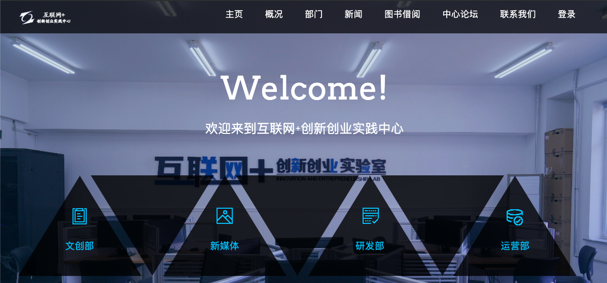
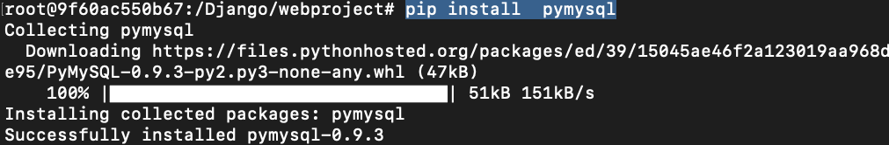
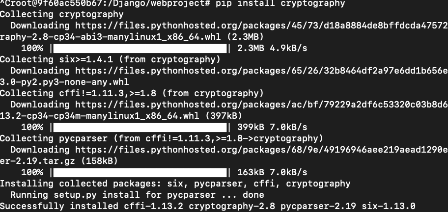

基于Django实现的移动、PC自适应官方网站
===
### 电脑端
  

#### [演示网址：http://www.lifemini.cn:9000](http://www.lifemini.cn:9000)
# 项目简介
随着互联网技术的发展和应用的普及，为宣传“互联网+”创新创业实践中心的仿真实验环境，提升管理效率开发本网站。前台借用于H5前端技术、后端借用Python语言的Django框架，网站适用性强，实现了PC端、手机端、“微信公众号”三位一体的自适应的无缝切换。


##### 这是我以前写的一个小项目，因为是很久以前写的项目，说明中过程整理可能补全。
##### 如果有问题，请提issue


# 版本说明
django 1.11.4  
docker 19.03.4  


# 交流分享

- 作者微信  


# 问题集锦

    Q:为什么显示我的数据库无法连接？
    A:可能是您没有在MySQL数据库上授予您配置的用户应有的权限。

    Q:使用的是python 2 还是 3？
    A:python3，若出错，请报BUG。

    Q:为什么没有后台的登录入口？
    A:前后台登录入口为同一个，使用账号的密码区分是否为管理者，
      管理者账号：admin
      管理者密码：admin

# 安装Django
本站采用Django较早期的版本，来实现此网站。   
为简化安装过程，采用基于go语言实现的docker容器技术下载Django，   
也便于后期项目的迁移工作的进行。
```
docker pull django
```
托取Django镜像。  
```
docker images

docker run -idt --name mydjango django -p 9000:9000
```
查看镜像是否加载成功,  
如果加载成功以名字mydjango的容器运行django。

```
docker ps
```
执行此命令便会查到正在运行的mydjango容器。


# 使用

### 初始化项目

```shell
   docker exec -it mydjango /bin/bash

   cd /

   apt-get update

   apt-get install git

   mkdir /Django

   cd /Django

   git init 

   git clone https://github.com/blackflagking/Django--HlwjOfficialWebsite.git
```
进入mydjango容器内部,使用git工具下载本项目。


```
   vi webproject/settings.py
   ......
   ......
   ALLOWED_HOSTS = ['120.0.0.1', '0.0.0.0:9000', '自己的域名']
   ......
   ......
   # mysql数据库
   MYSQL_HOST = '127.0.0.1'  #配置自己的数据库IP地址
   MYSQL_DBNAME = '******'   #配置自己的数据名
   MYSQL_USER = '******'     #配置自己的数据库用户
   MYSQL_PASSWD = '******'   #配置自己的数据库密码
```

在webproject/settings.py文件中配置自己服务器域名和数据库信息。  
如果没有服务器的朋友，可在此处使用'*'配置，在本地电脑跑本项目。


 
```
pip install  pymysql
```
 
```
pip install cryptography
```
下载相关依赖包，否则姓名无法正常进行。

```
cd /Django/webproject

python manage.py runserver 0.0.0.0:9000
```
在主机9000端口运行本项目。


# 微信公众号

咖啡是每个程序员的最爱！  
有了咖啡的陪伴，一个人才能度过coding之夜,
有了咖啡的陪伴，一个人的夜晚才算得上是完美。

本人，业余爱好咖啡，  
并经营一些咖啡相关商品，  
如果您也有喝咖啡的习惯，  
赶快来关注我的公众号吧，
---加我有优惠哦---


 


# TODO
- [x] ~~前台展示界面搭建完毕~~
- [x] ~~后台管理界面搭建完毕~~
- [x] ~~移动、PC字使用整合完毕~~


---
